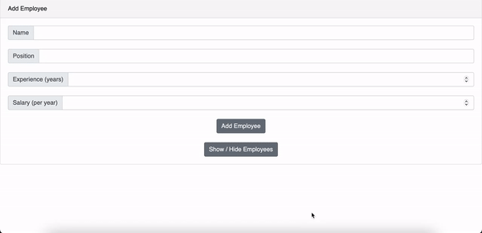

# Sample CRUD app for Employee Management

A simple CRUD application for employee data management.

# Build
This application uses [React.js](https://reactjs.org) as the front-end and [Node.js](https://nodejs.org/) with [Express web framework](https://expressjs.com) as the back-end. [mySQL](https://www.mysql.com) is used as a database. mySQL scripts are mentioned in the 'Available Scipts' section.

## Preview

## Features

* See employee information stored in the [mySQL](https://www.mysql.com) database.

* Add or remove an employee from the database.

* Edit employee salary.

## Dependencies

Please refer to package.json in the directory for the dependency list.

## Known Issues

* Unable to delete newly added row unless the page is refreshed. This is due to the defined id attribute in "DELETE FROM employees WHERE id =…” being seen as undefined until the page refreshes. This issue will be addressed in the upcoming version.

## Available Scripts

Navigate to the scripts folder and execute the following SQL scripts:

* initialize.sql - Creates the database employeedb and the table employees with its proper columns; id, name, position, experience, salary.

* seeds.sql - Optional. Can be used to feed the table with sample rows.

[mySQL Workbench](https://www.mysql.com/products/workbench) is recommended for running the scripts. Make sure the root password is set to 'Test#1234' upon installation.

Once in the project directory, you can run:

### `npm install`

Installs all the dependencies for the app to run. This process also needs to be repeated for the front end by navigating to 'client/sample-app' in your Terminal or Command Prompt.

### `npm start`

Runs the app (back-end and front-end simultaneously, thanks to the [nodemon](https://www.npmjs.com/package/nodemon package) in the development mode. 
Open [http://localhost:3000](http://localhost:3000) to view it in the browser.

The page will reload if you make edits. 
You will also see any lint errors in the console.

### `npm test`

Launches the test runner in the interactive watch mode. 
See the section about [running tests](https://facebook.github.io/create-react-app/docs/running-tests) for more information.

### `npm run build`

Builds the app for production to the `build` folder. 
It correctly bundles React in production mode and optimizes the build for the best performance.

The build is minified and the filenames include the hashes. 
Your app is ready to be deployed!

See the section about [deployment](https://facebook.github.io/create-react-app/docs/deployment) for more information.

### `npm run eject`

**Note: this is a one-way operation. Once you `eject`, you can’t go back!**

If you aren’t satisfied with the build tool and configuration choices, you can `eject` at any time. This command will remove the single build dependency from your project.

Instead, it will copy all the configuration files and the transitive dependencies (webpack, Babel, ESLint, etc) right into your project so you have full control over them. All of the commands except `eject` will still work, but they will point to the copied scripts so you can tweak them. At this point you’re on your own.

You don’t have to ever use `eject`. The curated feature set is suitable for small and middle deployments, and you shouldn’t feel obligated to use this feature. However we understand that this tool wouldn’t be useful if you couldn’t customize it when you are ready for it.

## Version History

* 1.0 Initial Release
